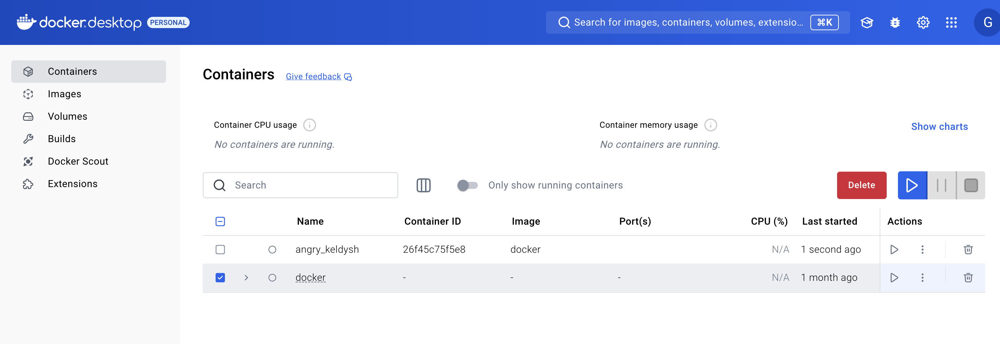
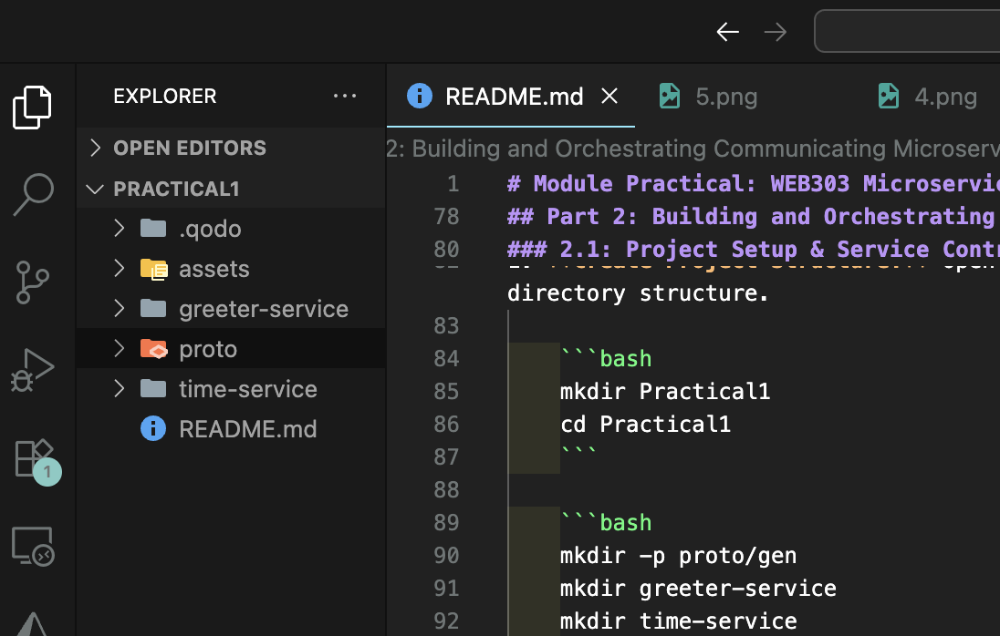
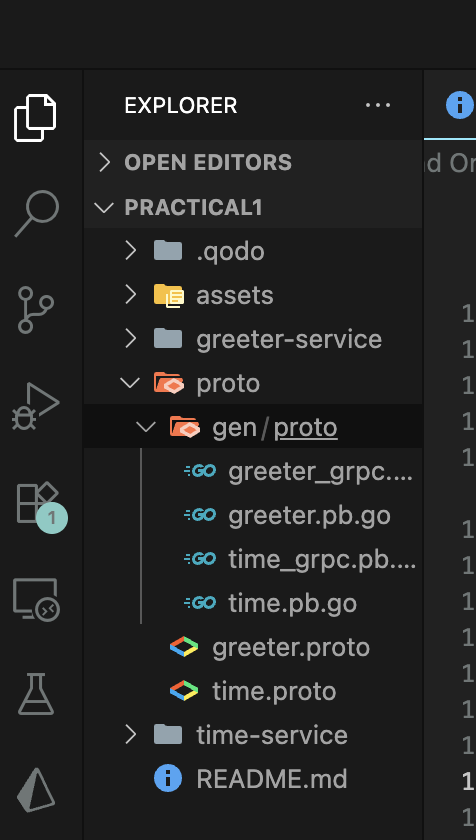
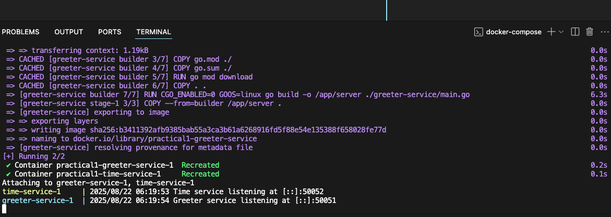

# Module Practical: Building and Orchestrating Microservices with Go, gRPC, and Docker

## Part 1: Set up a development environment for microservices using Go, gRPC, and Docker.

**Objective:** This part ensures your machine is ready for microservice development by installing and configuring Go, Protocol Buffers, and Docker.

### 1.1: Installing and Configuring Go

1. **Install Go**: Download and install Go from the [official Go website](https://golang.org/dl/).

2. **Verify Installation:** Open a terminal and run the following command:

   ```bash
   go version
   ```

   You should see the installed version of Go.

   

   ```bash
   go env
    ```
    This command will display the Go environment variables, including `GOPATH` and `GOROOT`.


### 1.2: Installing Protocol Buffers & gRPC Tools

1. **Install Protocal Buffer (Protobuf)** : For mac os 
   ```bash
   brew install protobuf
   ```

   For Linux:
   ```bash
   sudo apt install protobuf-compiler
   ```

   **Or**

   Go to the Protobuf GitHub Releases page [https://github.com/protocolbuffers/protobuf/releases](https://github.com/protocolbuffers/protobuf/releases), download the protoc-*-*.zip for your OS.

2. **Verify the installation by running**:

   ```bash
   protoc --version
   ```

   You should see the version of Protocol Buffers installed.

   

3. **Install Go Plugins**: These tools generate Go code from .proto files. Run the following in your terminal:

    ```bash
    go install google.golang.org/protobuf/cmd/protoc-gen-go@v1.28
    go install google.golang.org/grpc/cmd/protoc-gen-go-grpc@v1.2
    ```

    

### 1.3: Installing and Verifying Docker

1. **Install Docker**: Follow the instructions on the [Docker website](https://docs.docker.com/get-docker/) to install Docker for your operating system.
2. **Verify Docker Installation**: Open a terminal and run:

   ```bash
   docker --version
   ```

   You should see the installed version of Docker.

   
   

## Part 2: Building and Orchestrating Communicating Microservices (Duration: 1 Hour)

### 2.1: Project Setup & Service Contracts

1. **Create Project Structure:** Open your terminal and create the following directory structure.

    ```bash
    mkdir Practical1
    cd Practical1
    ```

    ```bash
    mkdir -p proto/gen
    mkdir greeter-service
    mkdir time-service
    ```
    

2. **Define the Time Service (proto/time.proto):** This service returns the current time.

    ```proto
    syntax = "proto3";

    option go_package = "practical-one/proto/gen;gen";

    package time;

    service TimeService {
    rpc GetTime(TimeRequest) returns (TimeResponse);
    }

    message TimeRequest {}

    message TimeResponse {
    string current_time = 1;
    }
    ```

3. **Define the Greeter Service (proto/greeter.proto):** This service provides a greeting.

    ```proto
    syntax = "proto3";

    option go_package = "practical-one/proto/gen;gen";

    package greeter;

    service GreeterService {
    rpc SayHello(HelloRequest) returns (HelloResponse);
    }

    message HelloRequest {
    string name = 1;
    }

    message HelloResponse {
    string message = 1;
    }
    ```

4. **Generate Go Code:** Run this protoc command from the root practical-one directory.

    ```bash 
    protoc --go_out=./proto/gen --go_opt=paths=source_relative \
    --go-grpc_out=./proto/gen --go-grpc_opt=paths=source_relative \
    proto/*.proto
    ```

    

### 2.2: Implementing the Microservices in Go

1. **Implement the time-service:** This is our first gRPC server.

- **Navigate to the time-service folder:**
    ```bash
    cd time-service
    ```

- **Initialize the Go module:**

    ```bash
    go mod init practical-one/time-service
    ```
    
    

- **Get dependencies:**

    ```bash
    go get google.golang.org/grpc
    ```
    

- **Create main.go with the following code:**

    ```bash
    touch main.go
    ```

    ```go
    package main

    import (
        "context"
        "log"
        "net"
        "time"
        pb "practical-one/proto/gen"
        "google.golang.org/grpc"
    )

    type server struct {
        pb.UnimplementedTimeServiceServer
    }

    func (s *server) GetTime(ctx context.Context, in *pb.TimeRequest) (*pb.TimeResponse, error) {
        log.Printf("Received request for time")
        currentTime := time.Now().Format(time.RFC3339)
        return &pb.TimeResponse{CurrentTime: currentTime}, nil
    }

    func main() {
        lis, err := net.Listen("tcp", ":50052")
        if err != nil {
            log.Fatalf("failed to listen: %v", err)
        }
        s := grpc.NewServer()
        pb.RegisterTimeServiceServer(s, &server{})
        log.Printf("Time service listening at %v", lis.Addr())
        if err := s.Serve(lis); err != nil {
            log.Fatalf("failed to serve: %v", err)
        }
    }
    ```

### 2.3: Containerization and Orchestration

- **Create Dockerfile for time-service (time-service/Dockerfile):**

    ```bash 
    cd time-service
    touch Dockerfile
    ```

    ```dockerfile
        FROM golang:1.22-alpine AS builder
        WORKDIR /app
        COPY go.mod ./
        COPY go.sum ./
        RUN go mod download
        COPY . .
        RUN CGO_ENABLED=0 GOOS=linux go build -o /app/server ./time-service/main.go

        FROM alpine:latest
        WORKDIR /app
        COPY --from=builder /app/server .
        EXPOSE 50052
        CMD ["/app/server"]
    ```

- **Create Dockerfile for greeter-service (greeter-service/Dockerfile):**

    ```bash
    cd greeter-service
    touch Dockerfile
    ```

    ```dockerfile
    FROM golang:1.22-alpine AS builder
    WORKDIR /app
    COPY go.mod ./
    COPY go.sum ./
    RUN go mod download
    COPY . .
    RUN CGO_ENABLED=0 GOOS=linux go build -o /app/server ./greeter-service/main.go

    FROM alpine:latest
    WORKDIR /app
    COPY --from=builder /app/server .
    EXPOSE 50051
    CMD ["/app/server"]
    ```

- **Create the docker-compose.yml File:** In the root practical-one directory, create this file to manage our services.

    ```bash 
    touch docker-compose.yml
    ```

    ```yaml
    version: '3.8'

    services:
    time-service:
        build:
        context: .
        dockerfile: time-service/Dockerfile
        hostname: time-service

    greeter-service:
        build:
        context: .
        dockerfile: greeter-service/Dockerfile
        hostname: greeter-service
        ports:
        - "50051:50051"
        depends_on:
        - time-service
    ```

### 2.4: Run and Verify! 

- **Run Docker Compose:** From the root of your practical-one directory, run:

    ```bash
    docker-compose up --build
    ```

    This command builds and starts both services.

    

- **Test the Endpoint:** To test the flow, we'll use grpcurl.

    1. **Install grpcurl** if you haven't already. You can find installation instructions [here](https://github.com/fullstorydev/grpcurl#installation).

    2. Open new terminal and run the following command to test the greeter service:

    ```bash
    grpcurl -plaintext \
    -import-path ./proto -proto greeter.proto \
    -d '{"name": "WEB303 Student"}' \
    0.0.0.0:50051 greeter.GreeterService/SayHello
    ```
    


