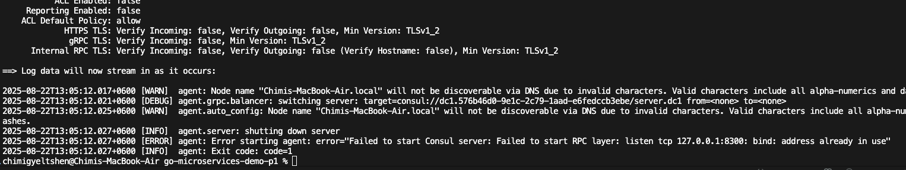
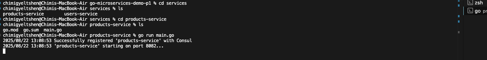
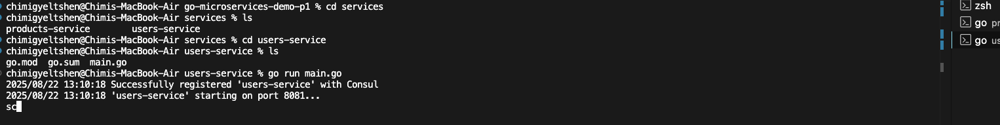
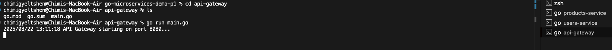
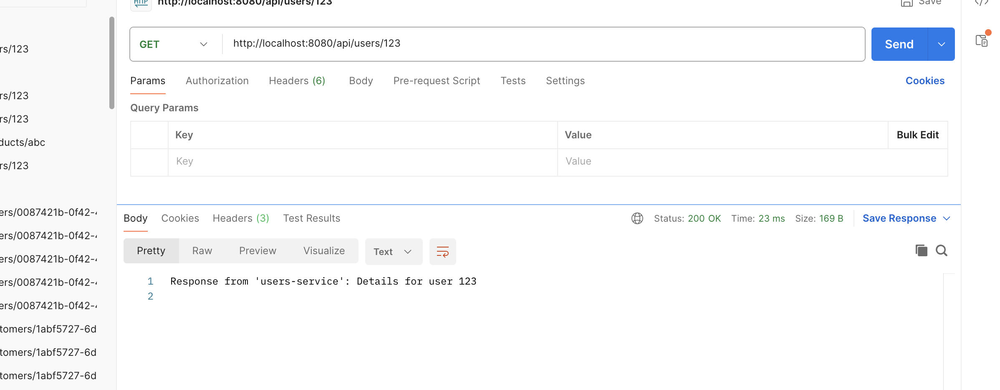
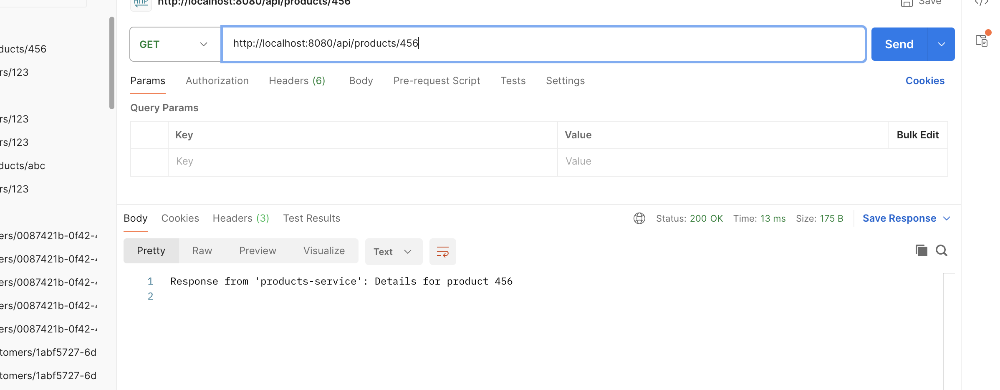
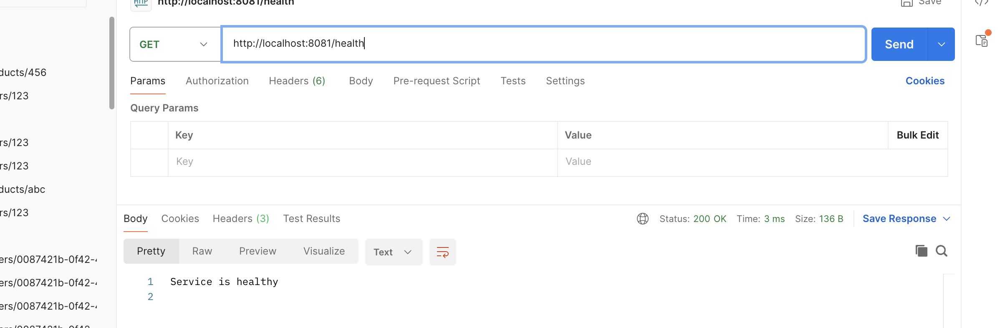
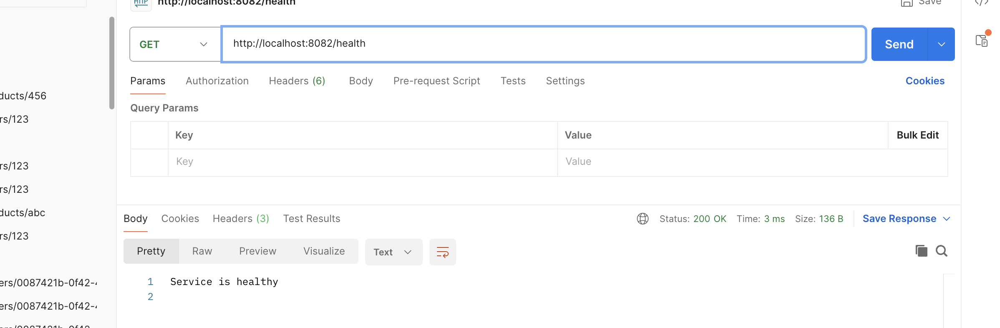
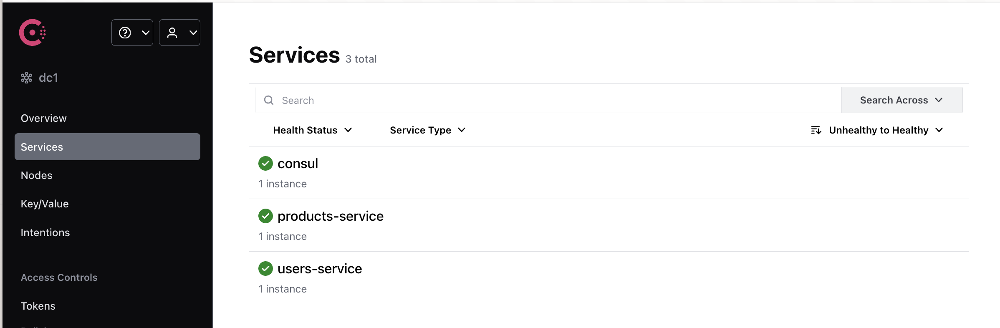
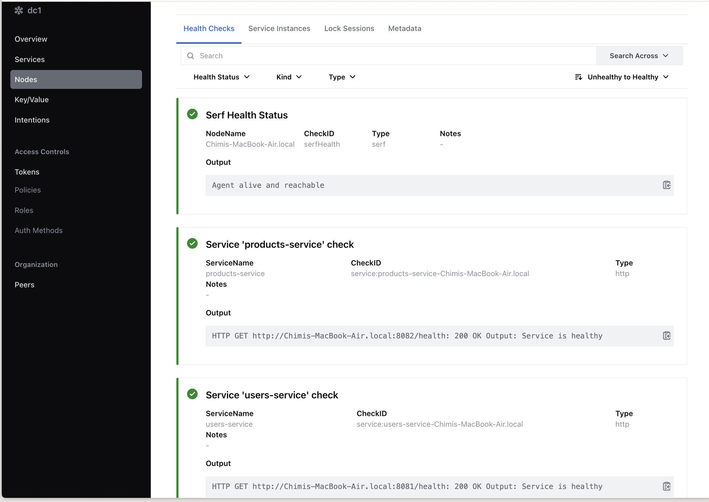

# Go Microservices Demo Project

## [Repository Link](https://github.com/C-gyeltshen/go-microservices-api-gateway.git)

## Overview

This project demonstrates a simple microservices architecture in Go, featuring:

- **API Gateway**: Routes requests to backend services.
- **Users Service**: Handles user-related endpoints.
- **Products Service**: Handles product-related endpoints.
- **Consul**: Used for service discovery and health checks.

---

## Architecture

```
[Client]
   |
   v
[API Gateway] <----> [Consul]
   |                    ^
   |                    |
   v                    |
[Users Service]         |
[Products Service] <----+
```

- The API Gateway receives all client requests and forwards them to the appropriate service based on the URL path.
- Each service registers itself with Consul for discovery and health checking.

---

## Features

- **API Gateway**
  - Routes `/api/users/*` to Users Service
  - Routes `/api/products/*` to Products Service
- **Users Service**
  - `GET /users/{id}`: Get user details
  - `GET /health`: Health check
- **Products Service**
  - `GET /products/{id}`: Get product details
  - `GET /health`: Health check

---

## Folder Structure

```
go-microservices-demo-p1/
├── api-gateway/
│   ├── main.go
│   ├── go.mod
│   └── go.sum
├── services/
│   ├── users-service/
│   │   ├── main.go
│   │   ├── go.mod
│   │   └── go.sum
│   └── products-service/
│       ├── main.go
│       ├── go.mod
│       └── go.sum
```

---

## Getting Started

### Prerequisites

- Go 1.18+
- [Consul](https://www.consul.io/downloads)

### 1. Start Consul Agent

```sh
consul agent -dev
```

explain me this command in short paragraph `consul agent -dev`. The consul agent -dev command starts a Consul agent in development mode.




### 2. Run Users Service

```sh
cd services/users-service
go run main.go
```


### 3. Run Products Service

```sh
cd services/products-service
go run main.go
```


### 4. Run API Gateway

```sh
cd api-gateway
go run main.go
```


---

## Usage

- **Get User**
  ```sh
  curl http://localhost:8080/api/users/123
  ```
  

- **Get Product**
  ```sh
  curl http://localhost:8080/api/products/456
  ```
  

- **Health Check**
  ```sh
  curl http://localhost:8081/health
  ```
  

  ```sh 
  curl http://localhost:8082/health
  ```
  

---

## Resolution

The microservices architecture successfully demonstrates the use of Go for building scalable services, with Consul providing essential service discovery and health checking capabilities.

1. Install Consul and run it in development mode.
2. Start each service in its respective directory.
3. Run the command ;

    ```sh 
        consul agent -dev
    ```

    Navigate to `http://localhost:8500/ui `

    

    


---

## Tech Stack

- Go : [https://golang.org/](https://golang.org/)
- Consul : [https://www.consul.io/](https://www.consul.io/)
- chi router : [https://github.com/go-chi/chi](https://github.com/go-chi/chi)

---


