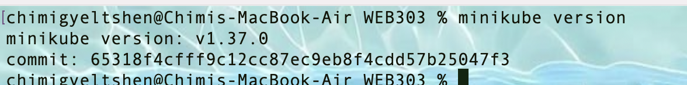
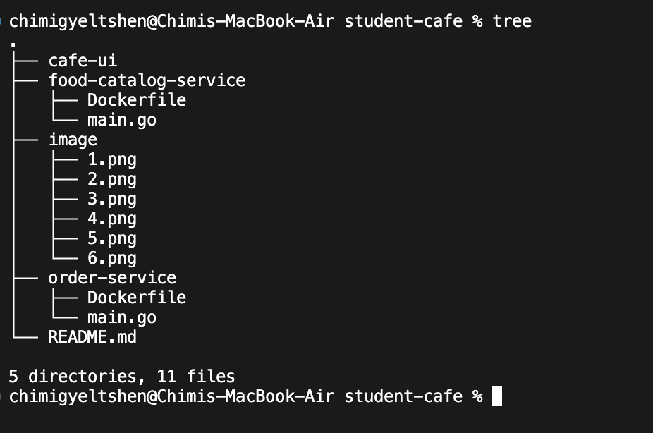
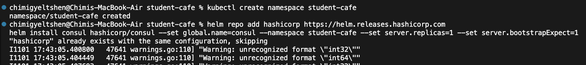
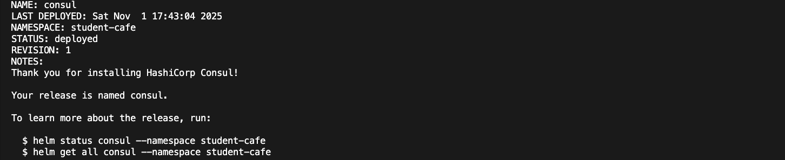
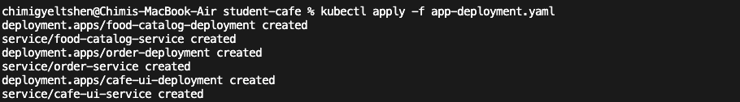

# Go Microservices Walkthrough: Student Cafe App

## [Repo Link](https://github.com/C-gyeltshen/student-cafe-microservices)

This guide will walk you through building and deploying a simple food ordering application. Students can view a list of food items and place an order.

## 1\. Architecture Overview

We will build a system with the following components:

- **Frontend (React.js):** A single-page application (SPA) that provides the user interface for students.
- **`food-catalog-service` (Go & Chi):** A microservice responsible for providing a list of available food items.
- **`order-service` (Go & Chi):** A microservice for creating and managing food orders.
- **Service Discovery (Consul):** Allows our microservices to find and communicate with each other without hardcoding IP addresses. Each service will register itself with Consul.
- **API Gateway (Kong):** A single entry point for all external traffic. The React frontend will communicate only with Kong, which will then intelligently route requests to the appropriate backend microservice.
- **Containerization & Orchestration (Docker & Kubernetes):** We will containerize each component (frontend, services) using Docker and deploy them on a local Kubernetes cluster (Minikube).

Here is the user flow:

1.  The student's browser loads the React application.
2.  The React app makes API calls to the Kong API Gateway.
3.  Kong routes traffic to the correct microservice (`/api/catalog` -\> `food-catalog-service`, `/api/orders` -\> `order-service`).
4.  The `order-service` needs data from the `food-catalog-service`, so it queries Consul to discover its location and then makes a direct internal request.
5.  All components run as pods within a Kubernetes cluster.

## 2\. Prerequisites

Ensure you have the following tools installed on your machine:

- **Go:** (version 1.18+)

    

- **Node.js & npm:** (for the React frontend)

    

    

- **Minikube:** (for a local Kubernetes cluster)

    

- **kubectl:** (the Kubernetes command-line tool)

    

- **Helm:** (the package manager for Kubernetes)

    
---

## 2\. Project Structure

```bash 

student-cafe/
├── food-catalog-service/
│   ├── main.go
│   └── Dockerfile
├── order-service/
│   ├── main.go
│   └── Dockerfile
└── cafe-ui/
    ├── (React app files)
    └── Dockerfile

```



## 3\. Microservice 1. food-catalog-service

`food-catalog-service/main.go`

```go
package main

import (
	"encoding/json"
	"fmt"
	"log"
	"net/http"
	"os"

	"github.com/go-chi/chi/v5"
	"github.com/go-chi/chi/v5/middleware"
	consulapi "github.com/hashicorp/consul/api"
)

type FoodItem struct {
	ID    string  `json:"id"`
	Name  string  `json:"name"`
	Price float64 `json:"price"`
}

var foodItems = []FoodItem{
	{ID: "1", Name: "Coffee", Price: 2.50},
	{ID: "2", Name: "Sandwich", Price: 5.00},
	{ID: "3", Name: "Muffin", Price: 3.25},
}

// Service registration with Consul
func registerServiceWithConsul() {
	config := consulapi.DefaultConfig()
	// In Kubernetes, Consul service is available at consul-server
	config.Address = "consul-server:8500"

	consul, err := consulapi.NewClient(config)
	if err != nil {
		log.Printf("Warning: Could not create Consul client: %v", err)
		return
	}

	registration := new(consulapi.AgentServiceRegistration)
	registration.ID = "food-catalog-service"
	registration.Name = "food-catalog-service"
	registration.Port = 8080
	// Get hostname to use as address
	hostname, err := os.Hostname()
	if err != nil {
		log.Fatalf("Could not get hostname: %v", err)
	}
	registration.Address = hostname

	// Add a health check
	registration.Check = &consulapi.AgentServiceCheck{
		HTTP:     fmt.Sprintf("http://%s:%d/health", hostname, 8080),
		Interval: "10s",
		Timeout:  "1s",
	}

	if err := consul.Agent().ServiceRegister(registration); err != nil {
		log.Printf("Warning: Failed to register service with Consul: %v", err)
		return
	}
	log.Println("Successfully registered service with Consul")
}

func main() {
	// Try to register with Consul, but don't fail if it's not available
	go registerServiceWithConsul()

	r := chi.NewRouter()
	r.Use(middleware.Logger)

	r.Get("/health", func(w http.ResponseWriter, r *http.Request) {
		w.WriteHeader(http.StatusOK)
	})

	r.Get("/items", func(w http.ResponseWriter, r *http.Request) {
		w.Header().Set("Content-Type", "application/json")
		json.NewEncoder(w).Encode(foodItems)
	})

	log.Println("Food Catalog Service starting on port 8080...")
	http.ListenAndServe(":8080", r)
}
```

`Dockerfile`

```dockerfile
# Stage 1: Build the Go binary
FROM golang:1.23-alpine AS builder

WORKDIR /app

# Copy go.mod and go.sum files
COPY go.mod go.sum ./
# Download all dependencies.
RUN go mod download

# Copy the source code
COPY . .

# Build the Go app
RUN CGO_ENABLED=0 GOOS=linux go build -o /food-catalog-service .

# Stage 2: Create a minimal final image
FROM alpine:latest

# We need consul binary for the health check
RUN apk --no-cache add curl

WORKDIR /

# Copy the binary from the builder stage
COPY --from=builder /food-catalog-service /food-catalog-service

# Expose port 8080
EXPOSE 8080

# Command to run the executable
CMD ["/food-catalog-service"]
```

`Initialize the GO module`

```bash 
cd food-catalog-service
go mod init food-catalog-service
go get github.com/go-chi/chi/v5
go get github.com/hashicorp/consul/api
go mod tidy
cd ..
```

## 4\. Microservice 2. order-service

`order-service/main.go`

```go
package main

import (
	"encoding/json"
	"fmt"
	"log"
	"net/http"
	"os"

	"github.com/go-chi/chi/v5"
	"github.com/go-chi/chi/v5/middleware"
	consulapi "github.com/hashicorp/consul/api"
	"github.com/hashicorp/go-uuid"
)

type Order struct {
	ID      string   `json:"id"`
	ItemIDs []string `json:"item_ids"`
	Status  string   `json:"status"`
}

var orders = make(map[string]Order)

// Service registration with Consul
func registerServiceWithConsul() {
    config := consulapi.DefaultConfig()
	// In Kubernetes, Consul service is available at consul-server
	config.Address = "consul-server:8500"

	consul, err := consulapi.NewClient(config)
	if err != nil {
		log.Printf("Warning: Could not create Consul client: %v", err)
		return
	}

	registration := new(consulapi.AgentServiceRegistration)
	registration.ID = "order-service"
	registration.Name = "order-service"
	registration.Port = 8081
	hostname, err := os.Hostname()
	if err != nil {
		log.Fatalf("Could not get hostname: %v", err)
	}
	registration.Address = hostname

	registration.Check = &consulapi.AgentServiceCheck{
		HTTP:     fmt.Sprintf("http://%s:%d/health", hostname, 8081),
		Interval: "10s",
		Timeout:  "1s",
	}

	if err := consul.Agent().ServiceRegister(registration); err != nil {
		log.Printf("Warning: Failed to register service with Consul: %v", err)
		return
	}
	log.Println("Successfully registered service with Consul")
}

// Discover other services using Consul
func findService(serviceName string) (string, error) {
    config := consulapi.DefaultConfig()
	// In Kubernetes, Consul service is available at consul-server
	config.Address = "consul-server:8500"

	consul, err := consulapi.NewClient(config)
	if err != nil {
		return "", err
	}

	services, _, err := consul.Health().Service(serviceName, "", true, nil)
	if err != nil {
		return "", err
	}

	if len(services) == 0 {
		return "", fmt.Errorf("could not find any healthy instance of %s", serviceName)
	}

	// In a real app, you'd implement load balancing here.
	// For now, we just take the first healthy instance.
	addr := services[0].Service.Address
	port := services[0].Service.Port
	return fmt.Sprintf("http://%s:%d", addr, port), nil
}


func main() {
	// Try to register with Consul, but don't fail if it's not available
	go registerServiceWithConsul()

	r := chi.NewRouter()
	r.Use(middleware.Logger)

	r.Get("/health", func(w http.ResponseWriter, r *http.Request) {
		w.WriteHeader(http.StatusOK)
	})

	r.Post("/orders", func(w http.ResponseWriter, r *http.Request) {
		var newOrder Order
		if err := json.NewDecoder(r.Body).Decode(&newOrder); err != nil {
			http.Error(w, err.Error(), http.StatusBadRequest)
			return
		}

        // Example of inter-service communication
        // Here you would call the food-catalog-service to validate ItemIDs
        catalogAddr, err := findService("food-catalog-service")
        if err != nil {
            http.Error(w, "Food catalog service not available", http.StatusInternalServerError)
            log.Printf("Error finding catalog service: %v", err)
            return
        }
        log.Printf("Found food-catalog-service at: %s. Would validate items here.", catalogAddr)


		orderID, _ := uuid.GenerateUUID()
		newOrder.ID = orderID
		newOrder.Status = "received"
		orders[orderID] = newOrder

		w.Header().Set("Content-Type", "application/json")
		w.WriteHeader(http.StatusCreated)
		json.NewEncoder(w).Encode(newOrder)
	})

	log.Println("Order Service starting on port 8081...")
	http.ListenAndServe(":8081", r)
}
```

`Dockerfile`

```dockerfile
# Stage 1: Build
FROM golang:1.23-alpine AS builder
WORKDIR /app
COPY go.mod go.sum ./
RUN go mod download
COPY . .
RUN CGO_ENABLED=0 GOOS=linux go build -o /order-service .

# Stage 2: Final image
FROM alpine:latest
WORKDIR /
COPY --from=builder /order-service /order-service
EXPOSE 8081
CMD ["/order-service"]
```

`Initialize the GO module`

```bash
cd order-service
go mod init order-service
go get github.com/go-chi/chi/v5
go get github.com/hashicorp/consul/api
go get github.com/hashicorp/go-uuid
go mod tidy
cd ..
```

## 5\. Frontend: cafe-ui (React.js)

- Create a new Next.js app:

    ```bash 
    cd cafe-ui
    npx create-next-app@latest
    ```

- Create a simple UI to list food items and place orders.

- Create Dockerfile for the React app:

    ```dockerfile
    # Stage 1: Build the React app
    FROM node:18-alpine as build
    WORKDIR /app
    COPY package.json ./
    COPY package-lock.json ./
    RUN npm install
    COPY . ./
    RUN npm run build

    # Stage 2: Serve with Nginx
    FROM nginx:stable-alpine
    COPY --from=build /app/build /usr/share/nginx/html
    # Nginx's default port is 80
    EXPOSE 80
    CMD ["nginx", "-g", "daemon off;"]
    ```

## 6\. Kubernetes Deployment

**Start Minikube**

```bash
minikube start
```
**Create namespace**

```bash
helm repo add hashicorp https://helm.releases.hashicorp.com
helm install consul hashicorp/consul --set global.name=consul --namespace student-cafe --set server.replicas=1 --set server.bootstrapExpect=1
```

**Deploy Consul:**
```bash
helm repo add hashicorp https://helm.releases.hashicorp.com
helm install consul hashicorp/consul --set global.name=consul --namespace student-cafe --set server.replicas=1 --set server.bootstrapExpect=1
```




## 7\. Build & Deploy Our Application

First build the three Docker images:

```bash
docker build -t food-catalog-service:v1 ./food-catalog-service
docker build -t order-service:v1 ./order-service
docker build -t cafe-ui:v1 ./cafe-ui
```


## 8\. Create Kubernetes deployment and service manifests

`app-deployment.yaml`

```bash 
kubectl apply -f app-deployment.yaml
```


## `9\. Access the Application`

```bash
minikube service -n student-cafe kong-kong-proxy --url
```
# Go Microservices Walkthrough: Student Cafe App

## [Repo Link](https://github.com/C-gyeltshen/student-cafe-microservices)

This guide will walk you through building and deploying a simple food ordering application. Students can view a list of food items and place an order.

## 1\. Architecture Overview

We will build a system with the following components:

- **Frontend (React.js):** A single-page application (SPA) that provides the user interface for students.
- **`food-catalog-service` (Go & Chi):** A microservice responsible for providing a list of available food items.
- **`order-service` (Go & Chi):** A microservice for creating and managing food orders.
- **Service Discovery (Consul):** Allows our microservices to find and communicate with each other without hardcoding IP addresses. Each service will register itself with Consul.
- **API Gateway (Kong):** A single entry point for all external traffic. The React frontend will communicate only with Kong, which will then intelligently route requests to the appropriate backend microservice.
- **Containerization & Orchestration (Docker & Kubernetes):** We will containerize each component (frontend, services) using Docker and deploy them on a local Kubernetes cluster (Minikube).

Here is the user flow:

1.  The student's browser loads the React application.
2.  The React app makes API calls to the Kong API Gateway.
3.  Kong routes traffic to the correct microservice (`/api/catalog` -\> `food-catalog-service`, `/api/orders` -\> `order-service`).
4.  The `order-service` needs data from the `food-catalog-service`, so it queries Consul to discover its location and then makes a direct internal request.
5.  All components run as pods within a Kubernetes cluster.

## 2\. Prerequisites

Ensure you have the following tools installed on your machine:

- **Go:** (version 1.18+)

    

- **Node.js & npm:** (for the React frontend)

    

- **Docker:** (for containerizing our apps)

    

- **Minikube:** (for a local Kubernetes cluster)

    

- **kubectl:** (the Kubernetes command-line tool)

    

- **Helm:** (the package manager for Kubernetes)

    
---

## 2\. Project Structure

```bash 

student-cafe/
├── food-catalog-service/
│   ├── main.go
│   └── Dockerfile
├── order-service/
│   ├── main.go
│   └── Dockerfile
└── cafe-ui/
    ├── (React app files)
    └── Dockerfile

```


## 3\. Microservice 1. food-catalog-service

`food-catalog-service/main.go`

```go
package main

import (
	"encoding/json"
	"fmt"
	"log"
	"net/http"
	"os"

	"github.com/go-chi/chi/v5"
	"github.com/go-chi/chi/v5/middleware"
	consulapi "github.com/hashicorp/consul/api"
)

type FoodItem struct {
	ID    string  `json:"id"`
	Name  string  `json:"name"`
	Price float64 `json:"price"`
}

var foodItems = []FoodItem{
	{ID: "1", Name: "Coffee", Price: 2.50},
	{ID: "2", Name: "Sandwich", Price: 5.00},
	{ID: "3", Name: "Muffin", Price: 3.25},
}

// Service registration with Consul
func registerServiceWithConsul() {
	config := consulapi.DefaultConfig()
	// In Kubernetes, Consul service is available at consul-server
	config.Address = "consul-server:8500"

	consul, err := consulapi.NewClient(config)
	if err != nil {
		log.Printf("Warning: Could not create Consul client: %v", err)
		return
	}

	registration := new(consulapi.AgentServiceRegistration)
	registration.ID = "food-catalog-service"
	registration.Name = "food-catalog-service"
	registration.Port = 8080
	// Get hostname to use as address
	hostname, err := os.Hostname()
	if err != nil {
		log.Fatalf("Could not get hostname: %v", err)
	}
	registration.Address = hostname

	// Add a health check
	registration.Check = &consulapi.AgentServiceCheck{
		HTTP:     fmt.Sprintf("http://%s:%d/health", hostname, 8080),
		Interval: "10s",
		Timeout:  "1s",
	}

	if err := consul.Agent().ServiceRegister(registration); err != nil {
		log.Printf("Warning: Failed to register service with Consul: %v", err)
		return
	}
	log.Println("Successfully registered service with Consul")
}

func main() {
	// Try to register with Consul, but don't fail if it's not available
	go registerServiceWithConsul()

	r := chi.NewRouter()
	r.Use(middleware.Logger)

	r.Get("/health", func(w http.ResponseWriter, r *http.Request) {
		w.WriteHeader(http.StatusOK)
	})

	r.Get("/items", func(w http.ResponseWriter, r *http.Request) {
		w.Header().Set("Content-Type", "application/json")
		json.NewEncoder(w).Encode(foodItems)
	})

	log.Println("Food Catalog Service starting on port 8080...")
	http.ListenAndServe(":8080", r)
}
```

`Dockerfile`

```dockerfile
# Stage 1: Build the Go binary
FROM golang:1.23-alpine AS builder

WORKDIR /app

# Copy go.mod and go.sum files
COPY go.mod go.sum ./
# Download all dependencies.
RUN go mod download

# Copy the source code
COPY . .

# Build the Go app
RUN CGO_ENABLED=0 GOOS=linux go build -o /food-catalog-service .

# Stage 2: Create a minimal final image
FROM alpine:latest

# We need consul binary for the health check
RUN apk --no-cache add curl

WORKDIR /

# Copy the binary from the builder stage
COPY --from=builder /food-catalog-service /food-catalog-service

# Expose port 8080
EXPOSE 8080

# Command to run the executable
CMD ["/food-catalog-service"]
```

`Initialize the GO module`

```bash 
cd food-catalog-service
go mod init food-catalog-service
go get github.com/go-chi/chi/v5
go get github.com/hashicorp/consul/api
go mod tidy
cd ..
```

## 4\. Microservice 2. order-service

`order-service/main.go`

```go
package main

import (
	"encoding/json"
	"fmt"
	"log"
	"net/http"
	"os"

	"github.com/go-chi/chi/v5"
	"github.com/go-chi/chi/v5/middleware"
	consulapi "github.com/hashicorp/consul/api"
	"github.com/hashicorp/go-uuid"
)

type Order struct {
	ID      string   `json:"id"`
	ItemIDs []string `json:"item_ids"`
	Status  string   `json:"status"`
}

var orders = make(map[string]Order)

// Service registration with Consul
func registerServiceWithConsul() {
    config := consulapi.DefaultConfig()
	// In Kubernetes, Consul service is available at consul-server
	config.Address = "consul-server:8500"

	consul, err := consulapi.NewClient(config)
	if err != nil {
		log.Printf("Warning: Could not create Consul client: %v", err)
		return
	}

	registration := new(consulapi.AgentServiceRegistration)
	registration.ID = "order-service"
	registration.Name = "order-service"
	registration.Port = 8081
	hostname, err := os.Hostname()
	if err != nil {
		log.Fatalf("Could not get hostname: %v", err)
	}
	registration.Address = hostname

	registration.Check = &consulapi.AgentServiceCheck{
		HTTP:     fmt.Sprintf("http://%s:%d/health", hostname, 8081),
		Interval: "10s",
		Timeout:  "1s",
	}

	if err := consul.Agent().ServiceRegister(registration); err != nil {
		log.Printf("Warning: Failed to register service with Consul: %v", err)
		return
	}
	log.Println("Successfully registered service with Consul")
}

// Discover other services using Consul
func findService(serviceName string) (string, error) {
    config := consulapi.DefaultConfig()
	// In Kubernetes, Consul service is available at consul-server
	config.Address = "consul-server:8500"

	consul, err := consulapi.NewClient(config)
	if err != nil {
		return "", err
	}

	services, _, err := consul.Health().Service(serviceName, "", true, nil)
	if err != nil {
		return "", err
	}

	if len(services) == 0 {
		return "", fmt.Errorf("could not find any healthy instance of %s", serviceName)
	}

	// In a real app, you'd implement load balancing here.
	// For now, we just take the first healthy instance.
	addr := services[0].Service.Address
	port := services[0].Service.Port
	return fmt.Sprintf("http://%s:%d", addr, port), nil
}


func main() {
	// Try to register with Consul, but don't fail if it's not available
	go registerServiceWithConsul()

	r := chi.NewRouter()
	r.Use(middleware.Logger)

	r.Get("/health", func(w http.ResponseWriter, r *http.Request) {
		w.WriteHeader(http.StatusOK)
	})

	r.Post("/orders", func(w http.ResponseWriter, r *http.Request) {
		var newOrder Order
		if err := json.NewDecoder(r.Body).Decode(&newOrder); err != nil {
			http.Error(w, err.Error(), http.StatusBadRequest)
			return
		}

        // Example of inter-service communication
        // Here you would call the food-catalog-service to validate ItemIDs
        catalogAddr, err := findService("food-catalog-service")
        if err != nil {
            http.Error(w, "Food catalog service not available", http.StatusInternalServerError)
            log.Printf("Error finding catalog service: %v", err)
            return
        }
        log.Printf("Found food-catalog-service at: %s. Would validate items here.", catalogAddr)


		orderID, _ := uuid.GenerateUUID()
		newOrder.ID = orderID
		newOrder.Status = "received"
		orders[orderID] = newOrder

		w.Header().Set("Content-Type", "application/json")
		w.WriteHeader(http.StatusCreated)
		json.NewEncoder(w).Encode(newOrder)
	})

	log.Println("Order Service starting on port 8081...")
	http.ListenAndServe(":8081", r)
}
```

`Dockerfile`

```dockerfile
# Stage 1: Build
FROM golang:1.23-alpine AS builder
WORKDIR /app
COPY go.mod go.sum ./
RUN go mod download
COPY . .
RUN CGO_ENABLED=0 GOOS=linux go build -o /order-service .

# Stage 2: Final image
FROM alpine:latest
WORKDIR /
COPY --from=builder /order-service /order-service
EXPOSE 8081
CMD ["/order-service"]
```

`Initialize the GO module`

```bash
cd order-service
go mod init order-service
go get github.com/go-chi/chi/v5
go get github.com/hashicorp/consul/api
go get github.com/hashicorp/go-uuid
go mod tidy
cd ..
```

## 5\. Frontend: cafe-ui (React.js)

- Create a new Next.js app:

    ```bash 
    cd cafe-ui
    npx create-next-app@latest
    ```

- Create a simple UI to list food items and place orders.

- Create Dockerfile for the React app:

    ```dockerfile
    # Stage 1: Build the React app
    FROM node:18-alpine as build
    WORKDIR /app
    COPY package.json ./
    COPY package-lock.json ./
    RUN npm install
    COPY . ./
    RUN npm run build

    # Stage 2: Serve with Nginx
    FROM nginx:stable-alpine
    COPY --from=build /app/build /usr/share/nginx/html
    # Nginx's default port is 80
    EXPOSE 80
    CMD ["nginx", "-g", "daemon off;"]
    ```

## 6\. Kubernetes Deployment

**Start Minikube**

```bash
minikube start
```
**Create namespace**

```bash
helm repo add hashicorp https://helm.releases.hashicorp.com
helm install consul hashicorp/consul --set global.name=consul --namespace student-cafe --set server.replicas=1 --set server.bootstrapExpect=1
```

**Deploy Consul:**
```bash
helm repo add hashicorp https://helm.releases.hashicorp.com
helm install consul hashicorp/consul --set global.name=consul --namespace student-cafe --set server.replicas=1 --set server.bootstrapExpect=1
```


## 7\. Build & Deploy Our Application

First build the three Docker images:

```bash
docker build -t food-catalog-service:v1 ./food-catalog-service
docker build -t order-service:v1 ./order-service
docker build -t cafe-ui:v1 ./cafe-ui
```


## 8\. Create Kubernetes deployment and service manifests

`app-deployment.yaml`

```bash 
kubectl apply -f app-deployment.yaml
```


## `9\. Access the Application`

```bash
minikube service -n student-cafe kong-kong-proxy --url
```
# Go Microservices Walkthrough: Student Cafe App

## [Repo Link](https://github.com/C-gyeltshen/student-cafe-microservices)

This guide will walk you through building and deploying a simple food ordering application. Students can view a list of food items and place an order.

## 1\. Architecture Overview

We will build a system with the following components:

- **Frontend (React.js):** A single-page application (SPA) that provides the user interface for students.
- **`food-catalog-service` (Go & Chi):** A microservice responsible for providing a list of available food items.
- **`order-service` (Go & Chi):** A microservice for creating and managing food orders.
- **Service Discovery (Consul):** Allows our microservices to find and communicate with each other without hardcoding IP addresses. Each service will register itself with Consul.
- **API Gateway (Kong):** A single entry point for all external traffic. The React frontend will communicate only with Kong, which will then intelligently route requests to the appropriate backend microservice.
- **Containerization & Orchestration (Docker & Kubernetes):** We will containerize each component (frontend, services) using Docker and deploy them on a local Kubernetes cluster (Minikube).

Here is the user flow:

1.  The student's browser loads the React application.
2.  The React app makes API calls to the Kong API Gateway.
3.  Kong routes traffic to the correct microservice (`/api/catalog` -\> `food-catalog-service`, `/api/orders` -\> `order-service`).
4.  The `order-service` needs data from the `food-catalog-service`, so it queries Consul to discover its location and then makes a direct internal request.
5.  All components run as pods within a Kubernetes cluster.

## 2\. Prerequisites

Ensure you have the following tools installed on your machine:

- **Go:** (version 1.18+)

    

- **Node.js & npm:** (for the React frontend)

    

- **Docker:** (for containerizing our apps)

    

- **Minikube:** (for a local Kubernetes cluster)

    

- **kubectl:** (the Kubernetes command-line tool)

    

- **Helm:** (the package manager for Kubernetes)

    
---

## 2\. Project Structure

```bash 

student-cafe/
├── food-catalog-service/
│   ├── main.go
│   └── Dockerfile
├── order-service/
│   ├── main.go
│   └── Dockerfile
└── cafe-ui/
    ├── (React app files)
    └── Dockerfile

```


## 3\. Microservice 1. food-catalog-service

`food-catalog-service/main.go`

```go
package main

import (
	"encoding/json"
	"fmt"
	"log"
	"net/http"
	"os"

	"github.com/go-chi/chi/v5"
	"github.com/go-chi/chi/v5/middleware"
	consulapi "github.com/hashicorp/consul/api"
)

type FoodItem struct {
	ID    string  `json:"id"`
	Name  string  `json:"name"`
	Price float64 `json:"price"`
}

var foodItems = []FoodItem{
	{ID: "1", Name: "Coffee", Price: 2.50},
	{ID: "2", Name: "Sandwich", Price: 5.00},
	{ID: "3", Name: "Muffin", Price: 3.25},
}

// Service registration with Consul
func registerServiceWithConsul() {
	config := consulapi.DefaultConfig()
	// In Kubernetes, Consul service is available at consul-server
	config.Address = "consul-server:8500"

	consul, err := consulapi.NewClient(config)
	if err != nil {
		log.Printf("Warning: Could not create Consul client: %v", err)
		return
	}

	registration := new(consulapi.AgentServiceRegistration)
	registration.ID = "food-catalog-service"
	registration.Name = "food-catalog-service"
	registration.Port = 8080
	// Get hostname to use as address
	hostname, err := os.Hostname()
	if err != nil {
		log.Fatalf("Could not get hostname: %v", err)
	}
	registration.Address = hostname

	// Add a health check
	registration.Check = &consulapi.AgentServiceCheck{
		HTTP:     fmt.Sprintf("http://%s:%d/health", hostname, 8080),
		Interval: "10s",
		Timeout:  "1s",
	}

	if err := consul.Agent().ServiceRegister(registration); err != nil {
		log.Printf("Warning: Failed to register service with Consul: %v", err)
		return
	}
	log.Println("Successfully registered service with Consul")
}

func main() {
	// Try to register with Consul, but don't fail if it's not available
	go registerServiceWithConsul()

	r := chi.NewRouter()
	r.Use(middleware.Logger)

	r.Get("/health", func(w http.ResponseWriter, r *http.Request) {
		w.WriteHeader(http.StatusOK)
	})

	r.Get("/items", func(w http.ResponseWriter, r *http.Request) {
		w.Header().Set("Content-Type", "application/json")
		json.NewEncoder(w).Encode(foodItems)
	})

	log.Println("Food Catalog Service starting on port 8080...")
	http.ListenAndServe(":8080", r)
}
```

`Dockerfile`

```dockerfile
# Stage 1: Build the Go binary
FROM golang:1.23-alpine AS builder

WORKDIR /app

# Copy go.mod and go.sum files
COPY go.mod go.sum ./
# Download all dependencies.
RUN go mod download

# Copy the source code
COPY . .

# Build the Go app
RUN CGO_ENABLED=0 GOOS=linux go build -o /food-catalog-service .

# Stage 2: Create a minimal final image
FROM alpine:latest

# We need consul binary for the health check
RUN apk --no-cache add curl

WORKDIR /

# Copy the binary from the builder stage
COPY --from=builder /food-catalog-service /food-catalog-service

# Expose port 8080
EXPOSE 8080

# Command to run the executable
CMD ["/food-catalog-service"]
```

`Initialize the GO module`

```bash 
cd food-catalog-service
go mod init food-catalog-service
go get github.com/go-chi/chi/v5
go get github.com/hashicorp/consul/api
go mod tidy
cd ..
```

## 4\. Microservice 2. order-service

`order-service/main.go`

```go
package main

import (
	"encoding/json"
	"fmt"
	"log"
	"net/http"
	"os"

	"github.com/go-chi/chi/v5"
	"github.com/go-chi/chi/v5/middleware"
	consulapi "github.com/hashicorp/consul/api"
	"github.com/hashicorp/go-uuid"
)

type Order struct {
	ID      string   `json:"id"`
	ItemIDs []string `json:"item_ids"`
	Status  string   `json:"status"`
}

var orders = make(map[string]Order)

// Service registration with Consul
func registerServiceWithConsul() {
    config := consulapi.DefaultConfig()
	// In Kubernetes, Consul service is available at consul-server
	config.Address = "consul-server:8500"

	consul, err := consulapi.NewClient(config)
	if err != nil {
		log.Printf("Warning: Could not create Consul client: %v", err)
		return
	}

	registration := new(consulapi.AgentServiceRegistration)
	registration.ID = "order-service"
	registration.Name = "order-service"
	registration.Port = 8081
	hostname, err := os.Hostname()
	if err != nil {
		log.Fatalf("Could not get hostname: %v", err)
	}
	registration.Address = hostname

	registration.Check = &consulapi.AgentServiceCheck{
		HTTP:     fmt.Sprintf("http://%s:%d/health", hostname, 8081),
		Interval: "10s",
		Timeout:  "1s",
	}

	if err := consul.Agent().ServiceRegister(registration); err != nil {
		log.Printf("Warning: Failed to register service with Consul: %v", err)
		return
	}
	log.Println("Successfully registered service with Consul")
}

// Discover other services using Consul
func findService(serviceName string) (string, error) {
    config := consulapi.DefaultConfig()
	// In Kubernetes, Consul service is available at consul-server
	config.Address = "consul-server:8500"

	consul, err := consulapi.NewClient(config)
	if err != nil {
		return "", err
	}

	services, _, err := consul.Health().Service(serviceName, "", true, nil)
	if err != nil {
		return "", err
	}

	if len(services) == 0 {
		return "", fmt.Errorf("could not find any healthy instance of %s", serviceName)
	}

	// In a real app, you'd implement load balancing here.
	// For now, we just take the first healthy instance.
	addr := services[0].Service.Address
	port := services[0].Service.Port
	return fmt.Sprintf("http://%s:%d", addr, port), nil
}


func main() {
	// Try to register with Consul, but don't fail if it's not available
	go registerServiceWithConsul()

	r := chi.NewRouter()
	r.Use(middleware.Logger)

	r.Get("/health", func(w http.ResponseWriter, r *http.Request) {
		w.WriteHeader(http.StatusOK)
	})

	r.Post("/orders", func(w http.ResponseWriter, r *http.Request) {
		var newOrder Order
		if err := json.NewDecoder(r.Body).Decode(&newOrder); err != nil {
			http.Error(w, err.Error(), http.StatusBadRequest)
			return
		}

        // Example of inter-service communication
        // Here you would call the food-catalog-service to validate ItemIDs
        catalogAddr, err := findService("food-catalog-service")
        if err != nil {
            http.Error(w, "Food catalog service not available", http.StatusInternalServerError)
            log.Printf("Error finding catalog service: %v", err)
            return
        }
        log.Printf("Found food-catalog-service at: %s. Would validate items here.", catalogAddr)


		orderID, _ := uuid.GenerateUUID()
		newOrder.ID = orderID
		newOrder.Status = "received"
		orders[orderID] = newOrder

		w.Header().Set("Content-Type", "application/json")
		w.WriteHeader(http.StatusCreated)
		json.NewEncoder(w).Encode(newOrder)
	})

	log.Println("Order Service starting on port 8081...")
	http.ListenAndServe(":8081", r)
}
```

`Dockerfile`

```dockerfile
# Stage 1: Build
FROM golang:1.23-alpine AS builder
WORKDIR /app
COPY go.mod go.sum ./
RUN go mod download
COPY . .
RUN CGO_ENABLED=0 GOOS=linux go build -o /order-service .

# Stage 2: Final image
FROM alpine:latest
WORKDIR /
COPY --from=builder /order-service /order-service
EXPOSE 8081
CMD ["/order-service"]
```

`Initialize the GO module`

```bash
cd order-service
go mod init order-service
go get github.com/go-chi/chi/v5
go get github.com/hashicorp/consul/api
go get github.com/hashicorp/go-uuid
go mod tidy
cd ..
```

## 5\. Frontend: cafe-ui (React.js)

- Create a new Next.js app:

    ```bash 
    cd cafe-ui
    npx create-next-app@latest
    ```

- Create a simple UI to list food items and place orders.

- Create Dockerfile for the React app:

    ```dockerfile
    # Stage 1: Build the React app
    FROM node:18-alpine as build
    WORKDIR /app
    COPY package.json ./
    COPY package-lock.json ./
    RUN npm install
    COPY . ./
    RUN npm run build

    # Stage 2: Serve with Nginx
    FROM nginx:stable-alpine
    COPY --from=build /app/build /usr/share/nginx/html
    # Nginx's default port is 80
    EXPOSE 80
    CMD ["nginx", "-g", "daemon off;"]
    ```

## 6\. Kubernetes Deployment

**Start Minikube**

```bash
minikube start
```
**Create namespace**

```bash
helm repo add hashicorp https://helm.releases.hashicorp.com
helm install consul hashicorp/consul --set global.name=consul --namespace student-cafe --set server.replicas=1 --set server.bootstrapExpect=1
```

**Deploy Consul:**
```bash
helm repo add hashicorp https://helm.releases.hashicorp.com
helm install consul hashicorp/consul --set global.name=consul --namespace student-cafe --set server.replicas=1 --set server.bootstrapExpect=1
```


## 7\. Build & Deploy Our Application

First build the three Docker images:

```bash
docker build -t food-catalog-service:v1 ./food-catalog-service
docker build -t order-service:v1 ./order-service
docker build -t cafe-ui:v1 ./cafe-ui
```


## 8\. Create Kubernetes deployment and service manifests

`app-deployment.yaml`

```bash 
kubectl apply -f app-deployment.yaml
```


## `9\. Access the Application`

```bash
minikube service -n student-cafe kong-kong-proxy --url
```
